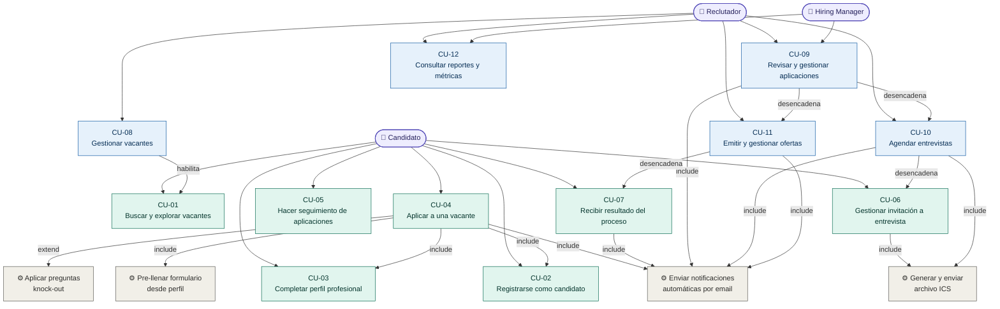
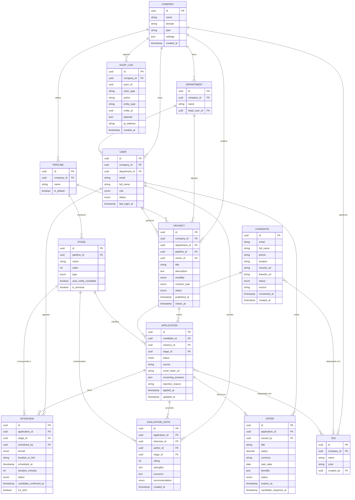
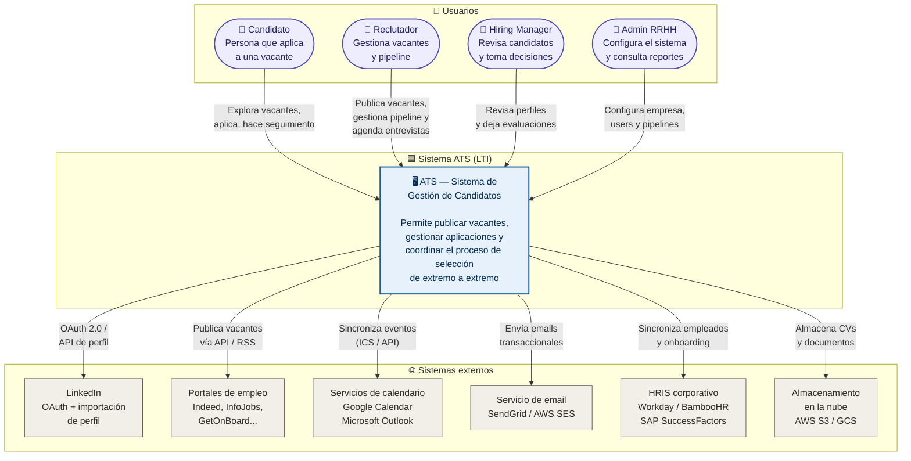
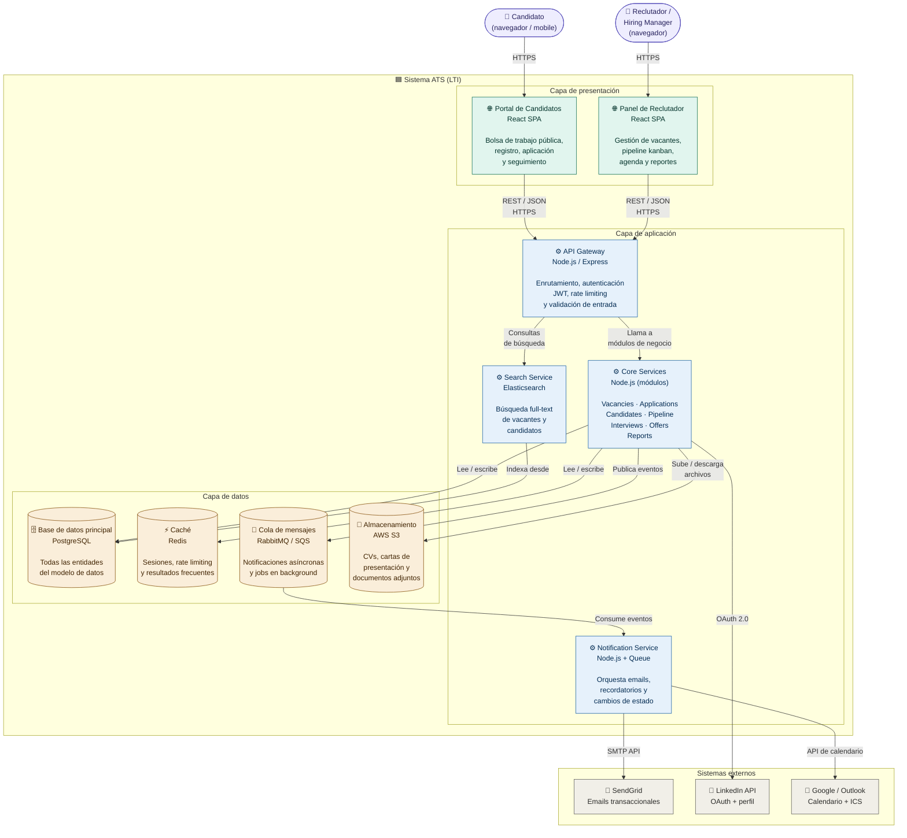
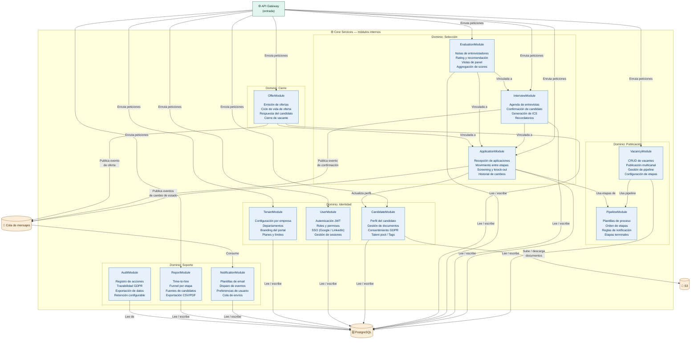

# LTI-DZ2 — PRD: Portal de Candidatos ATS

**Documento:** Product Requirements Document (PRD)
**Producto:** Portal de candidatos — módulo de aplicación y seguimiento de vacantes
**Versión:** 1.0
**Fecha:** Abril 2026
**Autor:** Product Management — LTI
**Estado:** Draft para revisión

---

## Índice

1. [Contexto y antecedentes](#1-contexto-y-antecedentes)
2. [Problema a resolver](#2-problema-a-resolver)
3. [Objetivos y métricas de éxito](#3-objetivos-y-métricas-de-éxito)
4. [Usuarios y segmentos](#4-usuarios-y-segmentos)
5. [User stories principales](#5-user-stories-principales)
6. [Requisitos funcionales](#6-requisitos-funcionales)
7. [Requisitos no funcionales](#7-requisitos-no-funcionales)
8. [Criterios de aceptación y definición de hecho](#8-criterios-de-aceptación-y-definición-de-hecho)
9. [Fuera de alcance](#9-fuera-de-alcance)
10. [Dependencias y supuestos](#10-dependencias-y-supuestos)
11. [Riesgos](#11-riesgos)
12. [Glosario](#12-glosario)

---

## 1. Contexto y antecedentes

Las empresas que adoptan un ATS invierten en optimizar el lado interno del reclutamiento: gestión de vacantes, pipelines y reportes para el equipo de RRHH. Sin embargo, la experiencia del candidato —la persona que aplica y atraviesa el proceso— suele quedar como un componente secundario o delegado a integraciones externas.

El candidato es el actor central del proceso de reclutamiento. Sin candidatos de calidad que completen sus aplicaciones, ningún ATS puede cumplir su propósito. Actualmente, el proceso de aplicación en la mayoría de los ATS del mercado es tedioso, opaco y no ofrece retroalimentación en tiempo real, lo que genera abandono, frustración y deterioro del employer branding.

Este PRD define los requisitos del **Portal de Candidatos**: el módulo del ATS orientado completamente al aplicante, que le permite descubrir vacantes, postularse, hacer seguimiento de su proceso y recibir comunicaciones oportunas durante todo el ciclo de selección.

---

## 2. Problema a resolver

### 2.1 Declaración del problema

> Los candidatos que quieren aplicar a una vacante de la empresa enfrentan un proceso fragmentado, con poca transparencia y sin capacidad de dar seguimiento a su postulación, lo que genera altas tasas de abandono y una percepción negativa de la empresa como empleador.

### 2.2 Evidencia del problema

- Según estudios de experiencia de candidato (CareerBuilder, LinkedIn Talent Trends), el **60% de los candidatos abandona una aplicación** si el proceso tarda más de 15 minutos o es confuso.
- El **83% de los candidatos** afirma que una mala experiencia en el proceso de selección los haría no recomendar la empresa a otros, incluso si la empresa les hace una oferta.
- Menos del **25% de las empresas** notifica activamente a los candidatos rechazados, lo que daña la percepción de la marca empleadora.
- Los candidatos en promedio aplican a **7–12 vacantes simultáneamente** y pierden el hilo de sus procesos por falta de centralización.

### 2.3 Jobs to be done (JTBD)

Cuando un candidato busca empleo activamente o evalúa nuevas oportunidades, quiere:

- **Descubrir** vacantes relevantes para su perfil sin ruido irrelevante.
- **Aplicar** de forma rápida y sin fricción, sin tener que repetir información ya disponible en su CV o LinkedIn.
- **Saber** en todo momento en qué etapa está su proceso y qué viene después.
- **Confiar** en que recibirá una respuesta, sea positiva o negativa, en un tiempo razonable.
- **Prepararse** adecuadamente para cada interacción (entrevista, prueba técnica, etc.).

---

## 3. Objetivos y métricas de éxito

### 3.1 Objetivos de negocio

| # | Objetivo | Horizonte |
|---|---|---|
| O1 | Reducir la tasa de abandono del formulario de aplicación | 6 meses post-lanzamiento |
| O2 | Mejorar el NPS de experiencia de candidato | 6 meses post-lanzamiento |
| O3 | Aumentar el porcentaje de candidatos que completan todas las etapas del proceso | 6 meses post-lanzamiento |
| O4 | Reducir las consultas al equipo de RRHH sobre estado del proceso | 3 meses post-lanzamiento |

### 3.2 OKRs del producto

**Objetivo:** Crear la mejor experiencia de aplicación del mercado para candidatos.

| Key Result | Línea base (estimada) | Meta a 6 meses |
|---|---|---|
| KR1: Tasa de abandono del formulario de aplicación | 55% | ≤ 25% |
| KR2: Tiempo promedio para completar una aplicación | 18 min | ≤ 8 min |
| KR3: NPS de experiencia de candidato (post-proceso) | 12 | ≥ 40 |
| KR4: % de candidatos que reciben notificación de estado en ≤ 5 días hábiles | 30% | ≥ 90% |
| KR5: Consultas a RRHH sobre estado del proceso (tickets/mes) | 100% baseline | Reducción ≥ 40% |
| KR6: Tasa de apertura de emails transaccionales del proceso | 35% | ≥ 60% |

---

## 4. Usuarios y segmentos

### 4.1 Actor principal: el candidato

El Portal de Candidatos tiene un único actor primario: **la persona que aplica o quiere aplicar a una vacante de la empresa**.

No existe distinción de nivel jerárquico, industria o perfil técnico dentro de este módulo. Sin embargo, se identifican tres arquetipos de comportamiento relevantes para el diseño:

---

**Arquetipo 1 — El candidato activo**

- Está en búsqueda activa de empleo.
- Aplica a múltiples empresas simultáneamente.
- Tiene poco tiempo y alta sensibilidad a la fricción.
- Necesita: proceso rápido, confirmación inmediata, seguimiento claro.

---

**Arquetipo 2 — El candidato pasivo**

- Tiene empleo actual pero está abierto a oportunidades.
- Llegó a la vacante por referido o por un anuncio específico.
- Evalúa con más calma, pero exige calidad en la comunicación.
- Necesita: información completa de la vacante, proceso transparente, respeto por su tiempo.

---

**Arquetipo 3 — El candidato interno**

- Es empleado actual de la empresa que aplica a otra posición interna.
- Necesita confidencialidad y un proceso diferenciado.
- Necesita: flujo separado, notificaciones discretas, no notificar a su manager actual.

---

### 4.2 Actores secundarios (no son usuarios del portal pero interactúan con él)

- **Reclutador:** recibe las aplicaciones en el backend del ATS; gestiona el pipeline.
- **Hiring manager:** puede revisar perfiles y dejar evaluaciones; no interactúa directamente con el candidato a través del portal.

---

## 5. User stories principales

Las user stories están organizadas por épicas funcionales. Cada historia incluye criterios de aceptación de alto nivel.

---

### Épica 1 — Descubrimiento de vacantes

**US-01 — Ver bolsa de trabajo pública**
> Como candidato, quiero acceder a una página pública con todas las vacantes activas de la empresa, para encontrar una oportunidad que se ajuste a mi perfil.

Criterios de aceptación:
- Las vacantes se muestran con título, área, ubicación, modalidad (presencial/híbrido/remoto) y fecha de publicación.
- El listado se puede filtrar por área, ubicación y tipo de contrato.
- Las vacantes cerradas no aparecen en el listado público.
- La página es accesible sin necesidad de crear una cuenta.

---

**US-02 — Ver detalle de una vacante**
> Como candidato, quiero ver el detalle completo de una vacante (descripción, requisitos, beneficios), para evaluar si aplica a mi perfil antes de postularme.

Criterios de aceptación:
- La página de detalle incluye: descripción del puesto, requisitos obligatorios y deseables, beneficios, ubicación y modalidad.
- Incluye un CTA claro para iniciar la aplicación.
- La URL de la vacante es compartible y única.

---

**US-03 — Buscar vacantes por palabra clave**
> Como candidato, quiero buscar vacantes usando palabras clave, para encontrar posiciones relevantes más rápidamente.

Criterios de aceptación:
- El buscador trabaja sobre título, descripción y área del puesto.
- Muestra resultados en tiempo real (< 500 ms).
- Si no hay resultados, muestra un mensaje amigable con sugerencias alternativas.

---

### Épica 2 — Registro y perfil del candidato

**US-04 — Crear cuenta de candidato**
> Como candidato, quiero crear una cuenta en el portal, para guardar mi perfil y hacer seguimiento de mis aplicaciones.

Criterios de aceptación:
- El registro puede hacerse con email + contraseña o con SSO (Google, LinkedIn).
- Se envía email de verificación al registrarse con email.
- El proceso de registro no requiere más de 3 campos obligatorios iniciales.

---

**US-05 — Completar perfil profesional**
> Como candidato, quiero completar mi perfil con mi información profesional, para no tener que repetirla en cada aplicación.

Criterios de aceptación:
- El perfil incluye: datos personales, resumen profesional, experiencia laboral, educación, habilidades e idiomas.
- Permite cargar CV en PDF (máx. 5 MB) o importar desde LinkedIn.
- Los datos del perfil se pre-llenan automáticamente en futuras aplicaciones.
- El candidato puede editar el perfil en cualquier momento.

---

**US-06 — Gestionar privacidad y preferencias**
> Como candidato, quiero controlar qué información es visible para la empresa y recibir solo las notificaciones que me interesan.

Criterios de aceptación:
- El candidato puede activar/desactivar notificaciones por email.
- Puede solicitar la eliminación de su cuenta y datos (cumplimiento GDPR/CCPA).
- Puede desactivar su perfil sin eliminarlo.

---

### Épica 3 — Proceso de aplicación

**US-07 — Aplicar a una vacante**
> Como candidato, quiero postularme a una vacante de forma rápida y sencilla, para no perder tiempo en formularios extensos.

Criterios de aceptación:
- Si el candidato tiene perfil, el formulario se pre-llena con sus datos.
- El formulario no tiene más de 5 pasos.
- Cada paso muestra una barra de progreso clara.
- Se puede guardar el borrador y continuar después.
- Al enviar, se muestra confirmación en pantalla y se envía email de confirmación.
- El tiempo de completado del formulario base es ≤ 8 minutos.

---

**US-08 — Adjuntar documentos adicionales**
> Como candidato, quiero adjuntar mi CV, carta de presentación u otros documentos solicitados, para complementar mi aplicación.

Criterios de aceptación:
- Soporta PDF, DOC, DOCX (máx. 5 MB por archivo).
- El CV es obligatorio; los demás documentos son opcionales salvo que la vacante los marque como requeridos.
- Se muestra confirmación visual al subir cada archivo.
- El candidato puede reemplazar un documento antes de enviar la aplicación.

---

**US-09 — Responder preguntas de screening**
> Como candidato, quiero responder preguntas específicas del puesto, para dar contexto adicional que no está en mi CV.

Criterios de aceptación:
- Las preguntas son configuradas por el reclutador por vacante.
- Pueden ser de tipo texto libre, opción múltiple, sí/no o numérico.
- Las preguntas eliminatorias (knock-out) informan al candidato de forma clara si no cumple el requisito mínimo antes de continuar.

---

**US-10 — Aplicar con perfil de LinkedIn (Easy Apply)**
> Como candidato, quiero usar mi perfil de LinkedIn para aplicar sin completar el formulario manualmente, para reducir la fricción al máximo.

Criterios de aceptación:
- La integración usa OAuth 2.0 con LinkedIn.
- Los datos importados (nombre, experiencia, educación) se muestran al candidato para revisión antes de enviar.
- El candidato puede editar cualquier campo importado antes de confirmar la aplicación.

---

### Épica 4 — Seguimiento del proceso

**US-11 — Ver estado de mis aplicaciones**
> Como candidato, quiero ver en qué etapa está cada una de mis aplicaciones activas, para saber qué esperar y cuándo.

Criterios de aceptación:
- El dashboard muestra todas las aplicaciones activas con su etapa actual (ej: "En revisión", "Entrevista agendada", "Evaluación técnica", "Oferta enviada").
- Cada etapa tiene una descripción breve de qué significa y qué viene después.
- Las aplicaciones cerradas (rechazadas o aceptadas) están en una sección separada de historial.

---

**US-12 — Recibir notificaciones de cambio de estado**
> Como candidato, quiero recibir un aviso cuando cambie el estado de mi aplicación, para estar al tanto sin tener que revisar el portal constantemente.

Criterios de aceptación:
- Se envía notificación por email en ≤ 1 hora desde el cambio de estado.
- Las notificaciones incluyen: nombre del puesto, nueva etapa y próximo paso esperado.
- El candidato puede gestionar sus preferencias de notificación desde su perfil.

---

**US-13 — Ver y aceptar/rechazar una invitación a entrevista**
> Como candidato, quiero recibir una invitación con fecha, hora y formato de la entrevista, y confirmarla o proponer otro horario.

Criterios de aceptación:
- La invitación llega por email y se muestra en el portal.
- El candidato puede confirmar, rechazar o solicitar cambio de horario directamente desde el portal.
- Al confirmar, se envía un evento de calendario (ICS) al email del candidato.
- El candidato recibe un recordatorio 24 horas antes de la entrevista.

---

**US-14 — Recibir feedback al finalizar el proceso**
> Como candidato, quiero recibir una comunicación clara cuando el proceso termina, sea con una oferta o con un rechazo, para poder seguir adelante con certeza.

Criterios de aceptación:
- En caso de rechazo, se envía email personalizado dentro de los 5 días hábiles de la decisión.
- En caso de oferta, el candidato recibe los detalles de la propuesta en el portal y por email.
- El candidato puede aceptar o rechazar la oferta desde el portal.
- El email de rechazo no expone información interna del proceso de selección.

---

### Épica 5 — Candidato interno

**US-15 — Aplicar a una vacante interna de forma confidencial**
> Como empleado de la empresa, quiero postularme a una vacante interna sin que mi manager actual sea notificado automáticamente, para proteger mi confidencialidad.

Criterios de aceptación:
- Las vacantes internas tienen una etiqueta diferenciadora en el portal.
- El flujo de aplicación interna no genera notificaciones hacia el manager directo del candidato.
- El candidato puede indicar si autoriza o no que se contacte a su manager como referencia.
- El reclutador ve en el ATS que es un candidato interno.

---

## 6. Requisitos funcionales

Los requisitos funcionales están organizados por módulo. Se clasifican por prioridad usando MoSCoW: **M** (Must have), **S** (Should have), **C** (Could have), **W** (Won't have en esta versión).

---

### 6.1 Módulo: Bolsa de trabajo pública

| ID | Requisito | Prioridad |
|---|---|---|
| RF-01 | Página pública de vacantes activas sin autenticación | M |
| RF-02 | Filtros por área, ubicación, modalidad y tipo de contrato | M |
| RF-03 | Buscador por texto libre sobre título y descripción | M |
| RF-04 | Página de detalle de vacante con URL canónica y compartible | M |
| RF-05 | Paginación o carga infinita del listado de vacantes | S |
| RF-06 | Vista de vacantes en mapa (por ubicación geográfica) | C |
| RF-07 | Alertas de nuevas vacantes por email al suscribirse | S |

### 6.2 Módulo: Registro y perfil

| ID | Requisito | Prioridad |
|---|---|---|
| RF-08 | Registro con email + contraseña y verificación por email | M |
| RF-09 | Login / registro con OAuth (Google y LinkedIn) | M |
| RF-10 | Recuperación de contraseña por email | M |
| RF-11 | Perfil con datos personales, experiencia, educación, habilidades e idiomas | M |
| RF-12 | Carga de CV en PDF (máx. 5 MB) | M |
| RF-13 | Importación de datos desde LinkedIn (perfil público) | S |
| RF-14 | Pre-llenado automático del formulario de aplicación con datos del perfil | M |
| RF-15 | Gestión de preferencias de notificación | M |
| RF-16 | Solicitud de eliminación de cuenta y datos (GDPR/CCPA) | M |

### 6.3 Módulo: Formulario de aplicación

| ID | Requisito | Prioridad |
|---|---|---|
| RF-17 | Formulario multi-paso con barra de progreso | M |
| RF-18 | Guardado automático de borrador de aplicación | M |
| RF-19 | Adjunto de CV, carta de presentación y documentos adicionales | M |
| RF-20 | Preguntas de screening por vacante (texto, opción múltiple, sí/no) | M |
| RF-21 | Preguntas knock-out con notificación inmediata al candidato | M |
| RF-22 | Confirmación en pantalla y por email al enviar la aplicación | M |
| RF-23 | Easy Apply con importación de LinkedIn | S |
| RF-24 | Límite de 1 aplicación activa por vacante por candidato | M |
| RF-25 | Posibilidad de retirar una aplicación antes del cierre | S |

### 6.4 Módulo: Seguimiento

| ID | Requisito | Prioridad |
|---|---|---|
| RF-26 | Dashboard personal con estado de todas las aplicaciones activas | M |
| RF-27 | Visualización de la etapa actual del proceso con descripción | M |
| RF-28 | Historial de aplicaciones cerradas (rechazadas/aceptadas) | M |
| RF-29 | Notificación por email en ≤ 1 hora ante cambio de estado | M |
| RF-30 | Invitación a entrevista con confirmación, rechazo o solicitud de cambio de horario desde el portal | M |
| RF-31 | Generación y envío de archivo ICS al confirmar entrevista | M |
| RF-32 | Recordatorio automático 24 h antes de una entrevista | M |
| RF-33 | Recepción y firma de oferta laboral digital desde el portal | S |
| RF-34 | Feedback de rechazo con email personalizado | M |

### 6.5 Módulo: Candidato interno

| ID | Requisito | Prioridad |
|---|---|---|
| RF-35 | Flujo de aplicación interna con etiqueta diferenciada en el portal | M |
| RF-36 | No notificar al manager del candidato interno de forma automática | M |
| RF-37 | Campo de autorización de contacto a referencia interna | M |
| RF-38 | Marcación de candidato interno visible para el reclutador en el ATS | M |

---

## 7. Requisitos no funcionales

### 7.1 Rendimiento

| ID | Requisito | Meta |
|---|---|---|
| RNF-01 | Tiempo de carga inicial de la bolsa de trabajo pública | ≤ 2 segundos (p95) |
| RNF-02 | Tiempo de respuesta del buscador de vacantes | ≤ 500 ms |
| RNF-03 | Tiempo de carga del formulario de aplicación | ≤ 1.5 segundos |
| RNF-04 | Tiempo de procesamiento de carga de archivos (hasta 5 MB) | ≤ 3 segundos |
| RNF-05 | Capacidad de sesiones concurrentes sin degradación | ≥ 5,000 sesiones simultáneas |

### 7.2 Disponibilidad y confiabilidad

| ID | Requisito | Meta |
|---|---|---|
| RNF-06 | Uptime del portal público | ≥ 99.5% mensual |
| RNF-07 | Uptime del portal autenticado (dashboard y aplicaciones) | ≥ 99.9% mensual |
| RNF-08 | Tiempo máximo de recuperación ante fallo (RTO) | ≤ 1 hora |
| RNF-09 | Pérdida máxima de datos ante fallo (RPO) | ≤ 15 minutos |
| RNF-10 | Las aplicaciones enviadas no pueden perderse por fallos de sistema | Garantía de durabilidad del 100% |

### 7.3 Seguridad

| ID | Requisito |
|---|---|
| RNF-11 | Autenticación mediante tokens JWT con expiración configurable |
| RNF-12 | Todas las comunicaciones sobre HTTPS / TLS 1.2 o superior |
| RNF-13 | Contraseñas almacenadas con hashing bcrypt (cost factor ≥ 12) |
| RNF-14 | Rate limiting en endpoints de login y registro (máx. 10 intentos/min por IP) |
| RNF-15 | Protección contra ataques CSRF en todos los formularios |
| RNF-16 | Escaneo de archivos subidos por el candidato (antimalware) antes de procesarlos |
| RNF-17 | Los datos de candidatos no se comparten con terceros sin consentimiento explícito |
| RNF-18 | Los documentos del candidato se almacenan cifrados en reposo (AES-256) |

### 7.4 Privacidad y cumplimiento normativo

| ID | Requisito |
|---|---|
| RNF-19 | Cumplimiento con GDPR (Reglamento General de Protección de Datos — UE) |
| RNF-20 | Cumplimiento con CCPA (California Consumer Privacy Act — si aplica) |
| RNF-21 | Consentimiento explícito del candidato antes de procesar sus datos |
| RNF-22 | Posibilidad de exportar todos los datos personales en formato legible (derecho de acceso) |
| RNF-23 | Eliminación efectiva de datos en ≤ 30 días ante solicitud del candidato |
| RNF-24 | Retención de datos de candidatos no contratados configurable por la empresa (máx. 2 años por defecto) |

### 7.5 Usabilidad y accesibilidad

| ID | Requisito |
|---|---|
| RNF-25 | Cumplimiento con WCAG 2.1 nivel AA |
| RNF-26 | Diseño completamente responsivo: desktop, tablet y mobile |
| RNF-27 | Soporte para los últimos 2 versiones de Chrome, Firefox, Safari y Edge |
| RNF-28 | El formulario de aplicación debe poder completarse en mobile sin necesidad de zoom |
| RNF-29 | Todos los textos de la interfaz deben estar disponibles en al menos español e inglés |
| RNF-30 | Los mensajes de error deben ser claros, en lenguaje natural y orientados a la acción |

### 7.6 Escalabilidad y mantenibilidad

| ID | Requisito |
|---|---|
| RNF-31 | Arquitectura que permita escalar horizontalmente sin cambios en la lógica de negocio |
| RNF-32 | Las configuraciones por empresa (campos, etapas, preguntas) deben ser multi-tenant sin hardcoding |
| RNF-33 | Cobertura de tests unitarios ≥ 80% en módulos críticos (aplicación, autenticación, notificaciones) |
| RNF-34 | API REST documentada con OpenAPI 3.0 para integraciones con el ATS backend |

---

## 8. Criterios de aceptación y definición de hecho

### 8.1 Definición de "listo para QA" (Definition of Ready)

Una historia de usuario está lista para entrar a sprint si:

- Tiene criterios de aceptación escritos y revisados con el equipo.
- El diseño UI/UX está aprobado en Figma.
- Las dependencias técnicas (APIs, endpoints) están identificadas.
- El equipo de QA ha preparado los escenarios de prueba.

### 8.2 Definición de "hecho" (Definition of Done)

Una historia de usuario se considera completada cuando:

- El código pasa todos los tests unitarios y de integración.
- Los criterios de aceptación han sido verificados manualmente por QA.
- No hay bugs de severidad alta o crítica abiertos.
- Ha pasado revisión de seguridad básica (OWASP Top 10 aplicable).
- La funcionalidad está documentada en el changelog del producto.
- Ha sido revisada por el Product Manager y aprobada.

### 8.3 Criterios de éxito del lanzamiento (go/no-go)

El portal se considera listo para lanzamiento productivo cuando:

| Criterio | Condición de aprobación |
|---|---|
| Todas las historias Must Have completadas | 100% |
| Tasa de error en formulario de aplicación (end-to-end) | < 0.5% |
| Tiempo de carga p95 de la bolsa de trabajo | ≤ 2 segundos |
| Cobertura de tests en módulos críticos | ≥ 80% |
| Prueba de accesibilidad WCAG 2.1 AA | Sin issues críticos |
| Prueba de carga con 5,000 sesiones concurrentes | Sin degradación > 20% |
| Revisión legal de flujo de consentimiento y datos (GDPR) | Aprobada por legal |
| Pilot interno con al menos 20 candidatos reales | NPS ≥ 30 |

---

## 9. Fuera de alcance

Los siguientes elementos quedan explícitamente **fuera del alcance de esta versión**:

- Módulo de gestión interna del reclutador (pipeline, scoring, reportes). Ese módulo tiene su propio PRD.
- Integración con plataformas de videoentrevista (Zoom, Teams). Se planifica para v1.1.
- Chatbot o asistente conversacional de soporte al candidato.
- Portal de candidatos en app nativa iOS/Android. La versión web responsiva cubre el caso de uso mobile para v1.0.
- Sistema de recomendación automática de vacantes basado en IA.
- Firma digital avanzada de ofertas con validez jurídica (se evalúa para v1.2).
- Publicación de vacantes en portales externos desde el portal candidato (ese flujo es del reclutador).

---

## 10. Dependencias y supuestos

### 10.1 Dependencias técnicas

- El ATS backend debe exponer una API REST con los endpoints de vacantes, estados de aplicación y configuración de etapas por empresa.
- El servicio de envío de emails transaccionales (SendGrid, SES o equivalente) debe estar configurado con los dominios de la empresa antes del lanzamiento.
- La integración con LinkedIn OAuth requiere una aplicación registrada y aprobada en LinkedIn Developer Platform.
- El almacenamiento de documentos (CVs, adjuntos) depende de un servicio de almacenamiento en la nube (S3 o equivalente).

### 10.2 Supuestos

- Las empresas cliente del ATS tendrán su propio subdominio o dominio personalizado para el portal (ej: `careers.acme.com`).
- El equipo de diseño entregará los componentes de UI en Figma antes del inicio del sprint de desarrollo.
- El equipo legal de cada empresa cliente es responsable de revisar y personalizar los textos de consentimiento y política de privacidad que se mostrarán en el portal.
- El módulo de candidato interno asume que el ATS tiene acceso al directorio de empleados de la empresa (vía HRIS o Active Directory).

---

## 11. Riesgos

| # | Riesgo | Probabilidad | Impacto | Mitigación |
|---|---|---|---|---|
| R1 | Baja adopción del portal por parte de candidatos que prefieren aplicar directamente por LinkedIn | Alta | Medio | Implementar Easy Apply (US-10) como prioridad; reducir fricción al mínimo. |
| R2 | Problemas de rendimiento con alto volumen de aplicaciones en convocatorias masivas | Media | Alto | Pruebas de carga en staging antes del lanzamiento; arquitectura con auto-scaling. |
| R3 | Incumplimiento de normativas de privacidad (GDPR) por configuración incorrecta de retención de datos | Baja | Muy alto | Revisión legal obligatoria antes del go-live; audit trail de consentimientos. |
| R4 | Pérdida de candidatos por preguntas knock-out mal configuradas por el reclutador | Media | Medio | Validación de preguntas knock-out en el flujo de configuración del reclutador; simulación previa. |
| R5 | Baja tasa de completado del formulario en dispositivos móviles | Media | Alto | Testing en dispositivos reales desde la fase de diseño; formulario mobile-first. |
| R6 | Dependencia de la API de LinkedIn para Easy Apply (cambios en sus políticas) | Baja | Medio | Easy Apply es Should Have (no bloqueante); la aplicación manual es el flujo principal. |

---

## 12. Glosario

| Término | Definición |
|---|---|
| **ATS** | Applicant Tracking System. Sistema de seguimiento de candidatos. |
| **Candidato** | Persona que aplica o está considerando aplicar a una vacante de la empresa. |
| **Pipeline** | Secuencia de etapas por las que atraviesa un candidato durante el proceso de selección. |
| **Easy Apply** | Flujo de aplicación simplificado que usa datos importados de LinkedIn para reducir la fricción. |
| **Knock-out question** | Pregunta de screening cuya respuesta negativa descarta automáticamente al candidato. |
| **Time-to-hire** | Tiempo transcurrido desde la publicación de una vacante hasta la aceptación de la oferta. |
| **NPS** | Net Promoter Score. Métrica de lealtad/satisfacción basada en la pregunta "¿qué tan probable es que recomiendes esta experiencia?". |
| **GDPR** | General Data Protection Regulation. Reglamento europeo de protección de datos. |
| **CCPA** | California Consumer Privacy Act. Ley de privacidad de datos del estado de California. |
| **WCAG** | Web Content Accessibility Guidelines. Estándares de accesibilidad web del W3C. |
| **ICS** | Formato de archivo estándar para eventos de calendario compatible con Google Calendar, Outlook y Apple Calendar. |
| **RPO** | Recovery Point Objective. Máxima pérdida de datos tolerable ante un fallo. |
| **RTO** | Recovery Time Objective. Tiempo máximo tolerable para restaurar el servicio tras un fallo. |
| **Multi-tenant** | Arquitectura de software donde una misma instancia del sistema sirve a múltiples clientes con datos aislados. |

---

## 13. Casos de uso principales

Esta sección describe los casos de uso fundamentales del sistema ATS, cubriendo tanto el portal del candidato como el módulo de gestión interna del reclutador. Juntos constituyen la funcionalidad básica mínima viable del sistema completo.

Los casos de uso están agrupados por actor principal y ordenados por prioridad de implementación. Cada uno incluye actores, precondiciones, flujo principal y postcondición.

---

### Actor: Candidato

---

#### CU-01 — Buscar y explorar vacantes

**Descripción:** El candidato accede al portal público, navega por las vacantes disponibles y aplica filtros para encontrar posiciones relevantes a su perfil.

**Actores:** Candidato (sin autenticación requerida).

**Precondiciones:** Existen al menos una vacante activa publicada en el sistema.

**Flujo principal:**
1. El candidato accede a la URL pública del portal de empleo.
2. El sistema muestra el listado de vacantes activas con título, área, ubicación y modalidad.
3. El candidato aplica uno o más filtros (área, tipo de contrato, modalidad, ubicación).
4. El sistema actualiza el listado en tiempo real con los resultados filtrados.
5. El candidato hace clic en una vacante de interés.
6. El sistema muestra la página de detalle con descripción completa, requisitos y beneficios.

**Flujos alternativos:**
- Si no hay resultados para los filtros aplicados, el sistema muestra un mensaje amigable y sugiere eliminar algún filtro.
- El candidato puede compartir la URL de una vacante específica directamente.

**Postcondición:** El candidato tiene información suficiente para decidir si postularse.

---

#### CU-02 — Registrarse como candidato

**Descripción:** El candidato crea una cuenta en el portal para poder postularse a vacantes y hacer seguimiento de sus aplicaciones.

**Actores:** Candidato nuevo (sin cuenta previa).

**Precondiciones:** El candidato no tiene cuenta registrada con ese email.

**Flujo principal:**
1. El candidato hace clic en "Registrarse" o en "Aplicar" a una vacante desde el listado.
2. El sistema presenta las opciones de registro: email + contraseña, Google o LinkedIn.
3. El candidato elige su método preferido y completa los campos requeridos (nombre, email, contraseña).
4. El sistema envía un email de verificación.
5. El candidato hace clic en el enlace de verificación.
6. El sistema activa la cuenta y redirige al candidato al portal autenticado.

**Flujos alternativos:**
- Si el email ya existe, el sistema informa al candidato y le ofrece la opción de iniciar sesión o recuperar contraseña.
- Si el candidato elige Google o LinkedIn, el paso de verificación de email se omite (el proveedor ya lo garantiza).

**Postcondición:** El candidato tiene una cuenta activa y puede acceder al portal autenticado.

---

#### CU-03 — Completar perfil profesional

**Descripción:** El candidato rellena su perfil con experiencia, formación y habilidades para agilizar futuras aplicaciones y mejorar su visibilidad.

**Actores:** Candidato autenticado.

**Precondiciones:** El candidato tiene una cuenta activa y ha iniciado sesión.

**Flujo principal:**
1. El candidato accede a la sección "Mi perfil".
2. El sistema muestra el formulario de perfil con las secciones: datos personales, resumen, experiencia laboral, educación, habilidades e idiomas.
3. El candidato completa cada sección y sube su CV en PDF.
4. El sistema valida los campos requeridos y guarda los cambios de forma incremental (autoguardado).
5. El candidato puede importar datos desde LinkedIn para pre-rellenar los campos.

**Flujos alternativos:**
- El candidato puede completar el perfil en varias sesiones; los cambios se guardan automáticamente.
- Si el archivo CV supera 5 MB, el sistema muestra un error claro indicando el límite.

**Postcondición:** El perfil del candidato está completo y listo para pre-rellenar futuras aplicaciones.

---

#### CU-04 — Aplicar a una vacante

**Descripción:** El candidato envía su postulación formal a una vacante de interés, completando el formulario de aplicación y adjuntando los documentos requeridos.

**Actores:** Candidato autenticado.

**Precondiciones:** La vacante está activa. El candidato no tiene una aplicación activa previa para esa misma vacante.

**Flujo principal:**
1. El candidato accede al detalle de una vacante y hace clic en "Aplicar".
2. El sistema pre-rellena el formulario multi-paso con los datos del perfil del candidato.
3. El candidato revisa y completa los datos en cada paso (datos personales → experiencia → documentos → preguntas de screening).
4. El sistema muestra una barra de progreso indicando el paso actual y el total.
5. El candidato responde las preguntas de screening configuradas para esa vacante.
6. El candidato adjunta o confirma el CV y, opcionalmente, una carta de presentación.
7. El candidato revisa el resumen de la aplicación y hace clic en "Enviar".
8. El sistema registra la aplicación con timestamp, asigna el estado inicial "Recibida" y envía un email de confirmación al candidato.

**Flujos alternativos:**
- Si una pregunta knock-out tiene respuesta eliminatoria, el sistema informa al candidato de forma inmediata y detiene el proceso con un mensaje claro.
- Si el candidato cierra el navegador antes de enviar, el sistema guarda el borrador y permite retomarlo en la siguiente sesión.
- Si el candidato ya aplicó previamente a esa vacante, el sistema lo informa y no permite duplicar la aplicación.

**Postcondición:** La aplicación queda registrada en el sistema, visible para el reclutador y con estado "Recibida".

---

#### CU-05 — Hacer seguimiento de aplicaciones

**Descripción:** El candidato consulta el estado actual de todas sus postulaciones activas e históricas desde su dashboard personal.

**Actores:** Candidato autenticado.

**Precondiciones:** El candidato tiene al menos una aplicación enviada.

**Flujo principal:**
1. El candidato accede a "Mis aplicaciones" en el portal.
2. El sistema muestra el listado de aplicaciones activas con el nombre de la vacante, empresa, fecha de aplicación y etapa actual.
3. El candidato hace clic en una aplicación para ver el detalle.
4. El sistema muestra el historial de etapas por las que ha pasado la aplicación, con fechas y descripción de cada una.
5. El sistema indica el próximo paso esperado (si lo hay) y la fecha estimada de respuesta (si está configurada).

**Flujos alternativos:**
- Las aplicaciones cerradas (rechazadas o finalizadas) están accesibles en una sección de historial separada.
- Si no hay aplicaciones activas, el sistema muestra un CTA para explorar vacantes disponibles.

**Postcondición:** El candidato tiene visibilidad completa y actualizada sobre el estado de su proceso.

---

#### CU-06 — Gestionar invitación a entrevista

**Descripción:** El candidato recibe, revisa y confirma (o rechaza / solicita cambio de) una invitación a entrevista enviada por el reclutador.

**Actores:** Candidato autenticado.

**Precondiciones:** El reclutador ha enviado una invitación a entrevista desde el ATS para una aplicación específica.

**Flujo principal:**
1. El candidato recibe una notificación por email con los detalles de la entrevista (fecha, hora, formato, enlace si es remota).
2. El candidato accede al portal y ve la invitación pendiente en su dashboard.
3. El candidato elige una de tres acciones: Confirmar, Rechazar o Solicitar cambio de horario.
4. Si confirma: el sistema registra la confirmación, notifica al reclutador y envía un archivo ICS al candidato.
5. Si solicita cambio: el candidato indica su disponibilidad y el sistema notifica al reclutador para reagendar.
6. El sistema envía un recordatorio automático 24 horas antes de la entrevista confirmada.

**Flujos alternativos:**
- Si el candidato no responde en el plazo configurado, el sistema envía un recordatorio de la invitación pendiente.

**Postcondición:** La entrevista queda confirmada o reprogramada; ambas partes tienen visibilidad del acuerdo.

---

#### CU-07 — Recibir resultado del proceso

**Descripción:** El candidato recibe la comunicación formal del resultado de su proceso de selección (oferta o rechazo) y puede actuar en consecuencia desde el portal.

**Actores:** Candidato autenticado.

**Precondiciones:** El reclutador ha tomado una decisión final sobre la aplicación del candidato.

**Flujo principal (rechazo):**
1. El reclutador marca la aplicación como "Rechazada" en el ATS.
2. El sistema envía automáticamente un email personalizado al candidato en ≤ 1 hora.
3. El email agradece la participación, informa la decisión y —si el reclutador lo habilita— invita al candidato a quedar en el talent pool.
4. La aplicación pasa al historial del candidato con estado "No seleccionado".

**Flujo principal (oferta):**
1. El reclutador emite una oferta formal desde el ATS con los detalles del puesto y condiciones.
2. El sistema notifica al candidato por email y en el portal.
3. El candidato accede al detalle de la oferta (cargo, salario, fecha de inicio, condiciones).
4. El candidato selecciona "Aceptar oferta" o "Rechazar oferta" desde el portal.
5. El sistema registra la decisión, notifica al reclutador y actualiza el estado de la aplicación.

**Postcondición:** El proceso de selección queda cerrado formalmente; el candidato tiene certeza del resultado.

---

### Actor: Reclutador

---

#### CU-08 — Gestionar vacantes

**Descripción:** El reclutador crea, edita, publica y cierra vacantes en el sistema, controlando su visibilidad en el portal público.

**Actores:** Reclutador autenticado.

**Precondiciones:** El reclutador tiene acceso al módulo de gestión del ATS con los permisos adecuados.

**Flujo principal:**
1. El reclutador accede al módulo de vacantes y hace clic en "Nueva vacante".
2. Completa los campos: título, área, descripción, requisitos, beneficios, tipo de contrato, ubicación, modalidad y fecha de cierre.
3. Configura las etapas del pipeline para esa vacante (o usa una plantilla).
4. Configura las preguntas de screening y, si aplica, las preguntas knock-out.
5. Selecciona el estado de publicación: Borrador, Activa (visible en portal) o Interna (solo candidatos internos).
6. El sistema publica la vacante y la hace disponible en el portal según la configuración elegida.

**Flujos alternativos:**
- El reclutador puede duplicar una vacante existente para agilizar la creación de posiciones similares.
- El reclutador puede cerrar una vacante activa en cualquier momento; las aplicaciones existentes se conservan.

**Postcondición:** La vacante está disponible en el portal y lista para recibir aplicaciones.

---

#### CU-09 — Revisar y gestionar aplicaciones recibidas

**Descripción:** El reclutador accede al listado de candidatos que han aplicado a una vacante, revisa sus perfiles y toma decisiones sobre su avance o descarte en el pipeline.

**Actores:** Reclutador autenticado. Hiring manager (rol de solo lectura y comentarios).

**Precondiciones:** Existe al menos una aplicación recibida para la vacante seleccionada.

**Flujo principal:**
1. El reclutador accede a la vista de pipeline de una vacante.
2. El sistema muestra los candidatos agrupados por etapa (kanban o lista).
3. El reclutador selecciona un candidato y accede a su ficha: CV, respuestas al screening, perfil y notas del equipo.
4. El reclutador decide avanzar al candidato a la siguiente etapa o descartarlo.
5. Si avanza: el sistema mueve al candidato a la nueva etapa y, si está configurado, envía notificación automática al candidato.
6. Si descarta: el reclutador selecciona un motivo de rechazo, el sistema registra la decisión y puede disparar el email de rechazo automático.

**Flujos alternativos:**
- El reclutador puede mover candidatos entre etapas mediante drag & drop en la vista kanban.
- El reclutador puede añadir notas internas visibles solo para el equipo de selección.
- El hiring manager puede dejar evaluaciones y comentarios sobre un candidato sin poder moverlo de etapa.

**Postcondición:** El pipeline está actualizado y el candidato recibe la comunicación correspondiente a su nueva etapa.

---

#### CU-10 — Agendar entrevistas

**Descripción:** El reclutador programa una entrevista para un candidato específico y la invitación se envía automáticamente al candidato para su confirmación.

**Actores:** Reclutador autenticado.

**Precondiciones:** El candidato se encuentra en una etapa de "Entrevista" dentro del pipeline.

**Flujo principal:**
1. El reclutador selecciona al candidato y hace clic en "Agendar entrevista".
2. El sistema muestra un formulario con: fecha, hora, duración, formato (presencial/videoconferencia/telefónica), enlace o dirección, y entrevistadores a invitar.
3. El reclutador completa los datos y confirma.
4. El sistema envía la invitación al candidato (email + notificación en el portal) y a los entrevistadores internos.
5. El candidato confirma o solicita cambio de horario (ver CU-06).
6. Una vez confirmada, el sistema bloquea el slot en los calendarios integrados y envía el ICS a todos los participantes.

**Flujos alternativos:**
- Si el candidato solicita un cambio de horario, el reclutador recibe la notificación y puede proponer una nueva fecha.
- El reclutador puede cancelar la entrevista, lo que genera notificaciones automáticas a todos los participantes.

**Postcondición:** La entrevista queda agendada, confirmada y visible en los calendarios de todos los participantes.

---

#### CU-11 — Emitir y gestionar ofertas

**Descripción:** El reclutador genera una oferta formal para un candidato seleccionado, la envía a través del portal y registra la respuesta del candidato.

**Actores:** Reclutador autenticado. Hiring manager (puede aprobar antes de enviar, si el flujo lo requiere).

**Precondiciones:** El candidato ha superado todas las etapas del proceso y existe una decisión de contratación.

**Flujo principal:**
1. El reclutador selecciona al candidato y hace clic en "Emitir oferta".
2. Completa los detalles de la oferta: cargo, salario, tipo de contrato, fecha de inicio, beneficios y fecha límite de respuesta.
3. El sistema genera la oferta y la envía al candidato por email y en el portal (ver CU-07).
4. El candidato acepta o rechaza la oferta desde el portal.
5. El sistema notifica al reclutador con la decisión del candidato en tiempo real.
6. Si es aceptada, el sistema actualiza el estado de la aplicación a "Contratado" y puede disparar el flujo de onboarding si está integrado.

**Flujos alternativos:**
- Si el candidato rechaza la oferta, el reclutador puede reabrir el proceso para otros candidatos en el pipeline.
- Si la oferta vence sin respuesta, el sistema alerta al reclutador para hacer seguimiento manual.

**Postcondición:** La oferta queda registrada con su resultado; el pipeline de la vacante refleja el estado final.

---

#### CU-12 — Consultar reportes y métricas del proceso

**Descripción:** El reclutador y el responsable de RRHH acceden a un panel de analítica para evaluar la eficiencia del proceso de selección y tomar decisiones informadas.

**Actores:** Reclutador autenticado. Responsable de RRHH / Director.

**Precondiciones:** Existen datos suficientes en el sistema (al menos un ciclo de selección completado).

**Flujo principal:**
1. El usuario accede al módulo de reportes del ATS.
2. El sistema muestra un dashboard con las métricas clave del período seleccionado.
3. Las métricas incluyen: número de vacantes activas/cerradas, total de aplicaciones recibidas por vacante, time-to-hire promedio, tasa de conversión por etapa, fuentes de candidatos más efectivas y NPS de candidatos (si está habilitado).
4. El usuario puede filtrar por período, área, vacante o reclutador responsable.
5. El usuario puede exportar el reporte en CSV o PDF.

**Flujos alternativos:**
- Si no hay datos suficientes para una métrica, el sistema muestra el campo vacío con un mensaje informativo, sin errores.

**Postcondición:** El equipo tiene visibilidad cuantitativa del proceso de selección para optimizar decisiones futuras.

---

### Diagrama de casos de uso

El siguiente diagrama muestra las relaciones entre actores y casos de uso del sistema ATS, incluyendo dependencias y extensiones entre casos.

**Leyenda:**
- Verde — casos de uso del candidato
- Azul — casos de uso del reclutador
- Gris — servicios automáticos del sistema (includes y extends)
- `include` — el caso de uso base siempre incorpora el comportamiento incluido
- `extend` — el caso de uso extiende al base solo bajo ciertas condiciones
- `habilita / desencadena` — dependencia de negocio entre casos de uso

---

### Resumen de casos de uso

| ID | Caso de uso | Actor principal | Prioridad |
|---|---|---|---|
| CU-01 | Buscar y explorar vacantes | Candidato | Must Have |
| CU-02 | Registrarse como candidato | Candidato | Must Have |
| CU-03 | Completar perfil profesional | Candidato | Must Have |
| CU-04 | Aplicar a una vacante | Candidato | Must Have |
| CU-05 | Hacer seguimiento de aplicaciones | Candidato | Must Have |
| CU-06 | Gestionar invitación a entrevista | Candidato | Must Have |
| CU-07 | Recibir resultado del proceso | Candidato | Must Have |
| CU-08 | Gestionar vacantes | Reclutador | Must Have |
| CU-09 | Revisar y gestionar aplicaciones recibidas | Reclutador | Must Have |
| CU-10 | Agendar entrevistas | Reclutador | Must Have |
| CU-11 | Emitir y gestionar ofertas | Reclutador | Should Have |
| CU-12 | Consultar reportes y métricas del proceso | Reclutador / RRHH | Should Have |

---

---

## 14. Modelo de datos

### 14.1 Entidades del sistema

El modelo de datos del ATS se compone de **12 entidades principales**. Las tres entidades base (Candidate, Vacancy, Application) se completan con otras 9 necesarias para cubrir la totalidad de los flujos del sistema.

---

#### Entidades base (ya definidas)

**Candidate** — La persona que aplica a una vacante. Es un actor externo al sistema con su propio perfil, historial de aplicaciones y documentos adjuntos.

Campos clave: `id`, `email` (único), `full_name`, `phone`, `location`, `resume_url`, `linkedin_url`, `status` (active / inactive / blocked), `source` (cómo llegó: portal, LinkedIn, referido…), `created_at`, `consented_at` (fecha de consentimiento GDPR).

---

**Vacancy** — El puesto de trabajo publicado por la empresa. Tiene su propio ciclo de vida (borrador → activa → cerrada → archivada) y pertenece a una empresa y un departamento.

Campos clave: `id`, `company_id` (FK), `department_id` (FK), `pipeline_id` (FK), `owner_id` (FK → User), `title`, `description`, `requirements`, `location`, `modality` (remote / hybrid / onsite), `contract_type`, `status` (draft / active / internal / closed / archived), `published_at`, `closes_at`.

---

**Application** — El vínculo entre un Candidate y una Vacancy. Registra el estado actual del candidato en el proceso, en qué etapa del pipeline se encuentra y cuándo ocurrió cada transición.

Campos clave: `id`, `candidate_id` (FK), `vacancy_id` (FK), `stage_id` (FK), `status` (received / in_review / in_process / offered / hired / rejected / withdrawn), `source`, `cover_letter_url`, `screening_answers` (JSON), `rejection_reason`, `applied_at`, `updated_at`.

---

#### Entidades complementarias

**Company** — Entidad raíz del modelo multi-tenant. Todas las vacantes, usuarios y configuraciones pertenecen a una empresa. Permite que el ATS sirva a múltiples clientes con datos completamente aislados.

Campos clave: `id`, `name`, `domain`, `logo_url`, `careers_page_url`, `plan` (starter / pro / enterprise), `settings` (JSON: retención de datos, idioma, timezone), `created_at`.

---

**User** — El actor interno del sistema (reclutador, hiring manager, admin). Completamente distinto al Candidate: tiene permisos por rol, pertenece a una empresa y gestiona vacantes y aplicaciones.

Campos clave: `id`, `company_id` (FK), `email`, `full_name`, `role` (admin / recruiter / hiring_manager), `department_id` (FK, opcional), `status` (active / inactive), `last_login_at`, `created_at`.

---

**Department** — Unidad organizativa de la empresa (Ingeniería, Marketing, Ventas, etc.). Agrupa vacantes y usuarios para filtrado, permisos y reporting por área de negocio.

Campos clave: `id`, `company_id` (FK), `name`, `head_user_id` (FK → User, opcional), `created_at`.

---

**Pipeline** — Plantilla de proceso de selección reutilizable. Una empresa puede tener distintos pipelines para distintos tipos de posiciones (técnico, comercial, ejecutivo). Cada vacante usa exactamente un pipeline.

Campos clave: `id`, `company_id` (FK), `name`, `description`, `is_default` (bool), `created_at`.

---

**Stage** — Cada etapa dentro de un pipeline (ej: CV Review → Phone Screen → Technical Interview → Offer). Define el orden, si genera notificación automática y si es una etapa terminal.

Campos clave: `id`, `pipeline_id` (FK), `name`, `order` (int), `type` (review / interview / assessment / offer / hired / rejected), `auto_notify_candidate` (bool), `notification_template_id` (FK, opcional), `is_terminal` (bool).

---

**Interview** — Registro de una sesión de entrevista agendada para una aplicación concreta. Puede haber múltiples entrevistas por aplicación. Conecta la aplicación con los entrevistadores internos y con el candidato.

Campos clave: `id`, `application_id` (FK), `stage_id` (FK), `scheduled_by` (FK → User), `format` (video / phone / onsite), `location_or_link`, `scheduled_at`, `duration_minutes`, `status` (pending / confirmed / completed / cancelled / rescheduled), `candidate_confirmed_at`, `ics_sent` (bool), `reminder_sent` (bool).

---

**Offer** — La propuesta formal de empleo emitida para un candidato que ha superado el proceso. Tiene su propio ciclo de vida independiente de la aplicación.

Campos clave: `id`, `application_id` (FK), `issued_by` (FK → User), `title`, `salary`, `currency`, `contract_type`, `start_date`, `benefits` (JSON), `status` (draft / sent / accepted / rejected / expired), `expires_at`, `candidate_response_at`, `notes`.

---

**EvaluationNote** — Valoración estructurada que un entrevistador (User) deja sobre un candidato tras una etapa del proceso. Permite múltiples evaluadores por entrevista y protege la deliberación interna del candidato.

Campos clave: `id`, `application_id` (FK), `interview_id` (FK, opcional), `author_id` (FK → User), `stage_id` (FK), `rating` (1–5), `strengths` (texto libre), `concerns` (texto libre), `recommendation` (advance / reject / hold), `is_visible_to_candidate` (bool, siempre false en v1.0), `created_at`.

---

**Tag** — Etiqueta libre aplicable a candidatos o aplicaciones para segmentación y búsqueda. Habilita el talent pool y la categorización sin modificar el esquema de las entidades principales.

Campos clave: `id`, `company_id` (FK), `name`, `color` (hex), `created_by` (FK → User), `created_at`.

Relación N:M con Candidate y con Application a través de tablas puente `candidate_tags` y `application_tags`.

---

**AuditLog** — Registro inmutable de cada acción relevante del sistema: quién hizo qué, sobre qué entidad y cuándo. Imprescindible para cumplimiento GDPR, auditorías legales y trazabilidad interna.

Campos clave: `id`, `company_id` (FK), `actor_id` (FK → User o Candidate), `actor_type` (user / candidate / system), `action` (created / updated / deleted / status_changed / login / data_export…), `entity_type` (application / vacancy / candidate / offer…), `entity_id`, `payload` (JSON: diff del cambio), `ip_address`, `created_at`.

---

### 14.2 Diagrama entidad-relación

---

### 14.3 Decisiones de diseño clave

**Separación Candidate / User.** Son entidades con naturaleza, permisos y ciclo de vida radicalmente distintos. Combinarlos en una sola tabla `Person` es un error frecuente que complica la seguridad y el modelo de permisos desde el día uno.

**Pipeline y Stage como entidades independientes.** No codificar las etapas directamente en la vacante permite que una empresa tenga varios tipos de proceso (técnico, ejecutivo, pasantía) y los reutilice sin duplicar configuración. Cada vacante apunta a un pipeline; cada aplicación apunta a la etapa actual dentro de ese pipeline.

**Application.stage_id es mutable; AuditLog es inmutable.** El estado actual de la aplicación se guarda en `Application.stage_id` para facilitar consultas. El historial completo de transiciones se reconstruye desde `AuditLog`, que nunca se modifica. Esto evita tablas de historial adicionales manteniendo trazabilidad completa.

**EvaluationNote separada de Interview.** Una entrevista puede tener múltiples evaluadores (panel). Cada uno deja su nota independiente. Si las notas vivieran en `Interview`, habría que usar arrays o filas duplicadas. La separación también permite notas de etapas sin entrevista formal (ej: revisión de CV).

**Tag como entidad N:M.** Las etiquetas son transversales a candidatos y aplicaciones. Modelarlas como entidad propia con tablas puente permite búsqueda eficiente, gestión centralizada por empresa y evita columnas de texto libre con valores inconsistentes.

**AuditLog sin FK rígidas.** `actor_id` y `entity_id` son UUIDs sin constraint de FK porque el log debe sobrevivir a la eliminación de la entidad referenciada (GDPR). El tipo se discrimina con `actor_type` y `entity_type`.

---

## 15. Arquitectura del sistema — Diagramas C4

El modelo C4 describe la arquitectura del sistema en cuatro niveles de zoom progresivo. Se presentan aquí los tres primeros niveles, que cubren el alcance actual del diseño.

---

### Nivel 1 — Diagrama de Contexto (System Context)

Muestra el sistema ATS en su entorno: quién lo usa y con qué sistemas externos se relaciona. Es el mapa de más alto nivel — sin detalles técnicos.

---

### Nivel 2 — Diagrama de Contenedores (Containers)

Descompone el sistema ATS en sus aplicaciones y servicios principales. Muestra qué tecnologías están implicadas y cómo se comunican entre sí.

---

### Nivel 3 — Diagrama de Componentes (Components)

Descompone el contenedor **Core Services** en sus módulos internos. Muestra las responsabilidades de cada componente y cómo fluyen las dependencias entre ellos.

---

### 15.4 Decisiones de arquitectura reflejadas en los diagramas

**Multi-tenancy en el núcleo.** El `TenantModule` es transversal a todos los demás: cada petición al API Gateway lleva el contexto de empresa (`company_id`) resuelto desde el JWT. Todos los módulos filtran automáticamente por tenant sin que el código de negocio tenga que recordarlo.

**Comunicación asíncrona para notificaciones.** El `ApplicationModule`, `InterviewModule` y `OfferModule` no llaman directamente al servicio de email — publican eventos en la cola. Esto desacopla el core del canal de comunicación, permite reintentos automáticos si SendGrid falla, y hace que añadir un canal nuevo (SMS, Slack) sea un cambio de configuración, no de código.

**Búsqueda separada del core.** El `Search Service` con Elasticsearch se alimenta de la base de datos principal mediante indexación asíncrona. La búsqueda full-text de vacantes y candidatos nunca toca PostgreSQL directamente, lo que protege el rendimiento del sistema transaccional bajo carga de búsqueda.

**S3 solo accesible desde CandidateModule.** Los documentos (CVs, cartas) se almacenan en S3 con URLs firmadas de tiempo limitado. Ningún otro módulo accede a S3 directamente — siempre pasan por `CandidateModule`, que centraliza las validaciones de tipo de archivo, tamaño y escaneo de malware.

**AuditModule como observador pasivo.** El `AuditModule` no es llamado por los demás módulos — lee eventos de la misma cola de mensajes que `NotificationModule`. Esto garantiza que el log de auditoría no puede ser omitido por error (nadie tiene que "acordarse" de llamarlo) y no añade latencia a las operaciones de negocio.

---

### DiagramGPT
title ATS Microservices Architecture (Computrabajo-style)

CDN [icon: globe]

Frontend [icon: react] {
  Web Application [icon: monitor]
}

"On-Premise Infrastructure" [icon: server] {
  Nginx Load Balancer [icon: nginx]
  
  API Gateway [icon: aws-api-gateway]
  
  Microservices [icon: docker, color: blue] {
    Job Listings Service [icon: list]
    Candidate Service [icon: users]
    Application Service [icon: file-text]
    Search Service [icon: search]
    Auth Service [icon: lock]
    Notification Service [icon: bell]
    Company Service [icon: briefcase]
  }
  
  Oracle Database [icon: database]
}

// Connections
CDN > Web Application
Web Application > Nginx Load Balancer
Nginx Load Balancer > API Gateway

API Gateway > Microservices

Microservices <> Oracle Database

*PRD v1.0 — Portal de Candidatos ATS — LTI-DZ2*
*Próxima revisión planificada: tras el primer sprint de discovery técnico*
